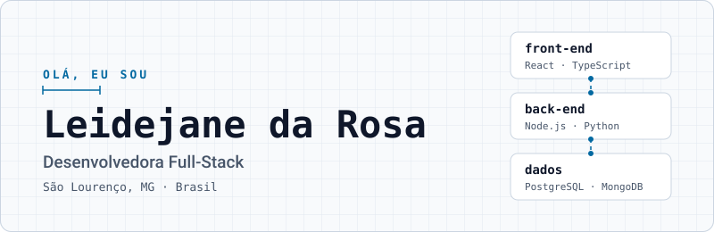

<h1 align="center">
  <picture>
    <source media="(prefers-color-scheme: dark)" srcset="assets/header-dark.svg">
    <source media="(prefers-color-scheme: light)" srcset="assets/header-light.svg">
    
  </picture>
</h1>

  Construo software com foco em <strong>arquitetura</strong>, <strong>acessibilidade</strong> e <strong>boas práticas</strong>, 
  do front-end em React e TypeScript ao back-end em Node.js e Python.

  <a href="https://leidejanedarosa.dev.br/">Portfólio</a> ·
  <a href="https://www.linkedin.com/in/leidejane/">LinkedIn</a> ·
  <a href="mailto:leidejanedarosa.81@gmail.com">E-mail</a> ·
  <a href="https://leidejanedarosa.dev.br/leidejane-da-rosa-curriculo.pdf">Currículo (PDF)</a>

## Sobre

Sou desenvolvedora full-stack e curso o Bacharelado em Engenharia de Software. Passei quase dois
anos na **Clarke Energia** atuando de ponta a ponta: componentes React no Design System, testes
automatizados e APIs em Python/Flask. Hoje trabalho como freelancer em projetos próprios e de
impacto social.

Minha história com tecnologia começou no Técnico em Informática, em 1997. Antes de voltar para a
área, toquei meu próprio negócio por sete anos — é de lá que vem a visão de produto e de cliente
que levo para o código.

> **Aberta a oportunidades:** busco uma posição plena, remota.

## Projetos em destaque

- **Faladoria** — [site](https://faladoria-web.vercel.app/) · [código](https://github.com/LeidejanedaRosa/faladoria-web) 
  Plataforma de mediação entre usuários do SUS e gestores públicos de saúde, com atendimento via WhatsApp. Front-end WCAG 2.2 AA com testes unitários, e2e e Lighthouse CI no pipeline; back-end (privado) integrado à Meta Cloud API. 
  `React 19` `TypeScript` `Fastify` `MongoDB` `Playwright` `Sentry`

- **FCR Certificados** — [verificador](https://validar-certificado.fcrcursosetreinamentos.com.br/) 
  Geração de certificados em lote a partir de CSV, com QR Code de verificação. API em Clean Architecture e verificador offline-first, sem framework. Código privado. 
  `Python` `Flask` `MongoDB` `JavaScript` `Jest`

- **EMR International** — [site](https://landing-page-emr-international.vercel.app/) · [código](https://github.com/LeidejanedaRosa/landing-page-emr-international-frontend) 
  Landing page de treinamentos de atendimento pré-hospitalar tático. PWA com navegação completa por teclado e monitoramento de erros. 
  `React 19` `Vite` `Tailwind CSS` `Workbox` `Sentry`

- **Espaço Saúde e Bem-Estar** — [site](https://landing-espaco-saude-bemestar.vercel.app) · [código](https://github.com/LeidejanedaRosa/landing-espaco-saude-bemestar) 
  Site institucional responsivo e acessível para um espaço de bem-estar. 
  `TypeScript` `Vite` `Tailwind CSS`

- **react-vite-template** — [código](https://github.com/LeidejanedaRosa/react-vite-template) 
  Meu ponto de partida para projetos React: testes unitários e e2e, acessibilidade, SEO, git hooks e CI prontos desde o primeiro commit. 
  `React` `Vite` `Vitest` `Playwright` `Husky`

- **Portfólio** — [site](https://leidejanedarosa.dev.br/) · [código](https://github.com/LeidejanedaRosa/portfolio) 
  Onde conto minha trajetória e detalho cada projeto desta lista. 
  `React 19` `TypeScript` `Tailwind CSS` `Framer Motion`

## Stack

| Camada | Tecnologias |
| --- | --- |
| **Front-end** | `React` `TypeScript` `Tailwind CSS` `styled-components` `Zod` |
| **Back-end** | `Node.js` `Express` `Fastify` `Python` `Flask` `Celery` |
| **Dados** | `PostgreSQL` `MongoDB` `Redis` |
| **Qualidade e entrega** | `Vitest` `Jest` `Pytest` `Playwright` `Cypress` `Storybook` `GitHub Actions` `Docker` `Sentry` |

## Como eu trabalho

- **Arquitetura proporcional ao problema.** Uma landing page não precisa de DDD; um back-end com regra de negócio complexa precisa.
- **Teste valida regra de negócio.** Cobertura alta sem asserção que importa não conta.
- **Acessibilidade desde o primeiro componente.** HTML semântico, navegação por teclado e WCAG como requisito, não como retoque.
- **Qualidade automatizada.** Lint, testes, auditoria de dependências e Lighthouse rodando no CI antes da primeira feature.
- **Decisão documentada.** Backlog, decisões de arquitetura e aprendizados ficam no repositório.

## Trajetória

| Período | Atuação | Onde |
| --- | --- | --- |
| 2026 – 2030 | Bacharelado em Engenharia de Software (cursando) | UNICIVE |
| 2025 – atual | Desenvolvedora freelancer | Projetos próprios e de impacto social |
| 2025 – atual | Desenvolvedora full-stack voluntária | [SouJunior](https://github.com/SouJunior) |
| 2023 – 2025 | Desenvolvedora full-stack | Clarke Energia |
| 2024 | Monitora do curso de Desenvolvimento de Software Full Stack | Cubos Academy |
| 2022 – 2023 | Formação em Desenvolvimento de Software Full Stack | Cubos Academy |
| 2013 – 2020 | Empreendedora | Estação Festas |

## Estudando agora

Arquitetura de software, DDD, Clean Architecture e TDD — além dos fundamentos de engenharia que
sustentam tudo isso: dados, concorrência, sistemas distribuídos e resiliência.

## Contato

O melhor caminho é o [LinkedIn](https://www.linkedin.com/in/leidejane/) ou o e-mail
[leidejanedarosa.81@gmail.com](mailto:leidejanedarosa.81@gmail.com). Os detalhes de cada projeto
estão no [portfólio](https://leidejanedarosa.dev.br/).

<em>“A única maneira de ir rápido é ir bem.”</em> — Robert C. Martin

